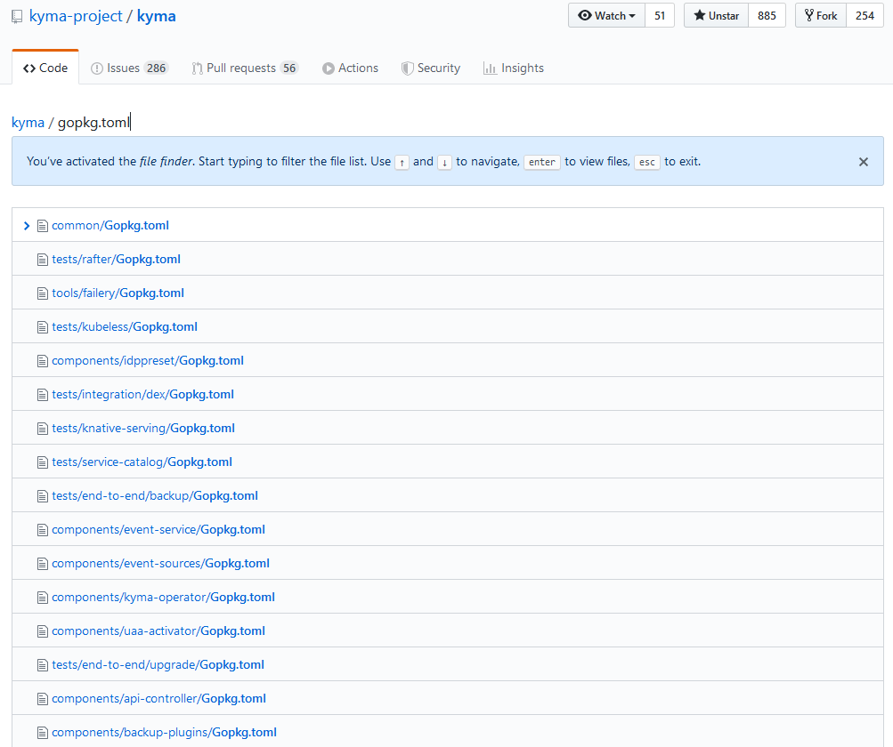

# go-modules-workshop

## What to expect
---
- A good understanding of go modules to work with it
- Ability to switch from `dep` to modules in projects we own

> NOTE: This is targeted to users of `go` versions 1.11+. As of writing this you hopefully have installed `go` v1.14 already.

## Differences between `dep` and `mod`
| | dep | mod |
|---|---|---|
| Projects outside `$GOPATH`? | no | yes |
| Versioned dependencies? | yes | yes |
| Requires an extra binary? | yes | no |

## Why should we use `mod`?
To quote a [blog post][1]:
> Go modules are the future of dependency management in Go. Module functionality is now available in all supported Go versions.

It actually became the default with `go` v1.14.

## How do I create a `mod` project?
When you create a git repository for example on GitHub.com, the path to your repository will end up to be your repositories path.

For example for the `go-cli-workshop` the repository can be found here: https://github.com/tehcyx/go-cli-workshop.

To initialize the module I ran `go mod init github.com/tehcyx/go-cli-workshop`. You can see that the repository name is written to the [`go.mod` file](https://github.com/tehcyx/go-cli-workshop/blob/master/go.mod#L1).

## How do I add dependencies to my project?
While IDEs like Visual Studio Code or Goland don't have you worry about this, it's still good to know in case you don't have these tools at hand.

Due to the deep integration with go itself, any invocation of `go get <dependency>` or `go get -u <dependency>` will write to `go.mod`. In the IDEs mentioned above this command is triggered (depending on configuration, but most of the time as a 'save file'-action).

If you want to find out why a dependency is in your go.mod you can run `go mod why <dependency>` and the output will tell you which package is using this dependency.

Sometimes you end up with third party (indirect) dependencies. You can get a better understanding of what and how they end up in your project by checking the output of `go mod graph`.

`go mod` dependencies are automatically versioned, even if the originating repository itself does not have a release. Good practice is to tag commits (with semantic versions).
```
$ git tag v1.2.0
$ git push origin v1.2.0
```
You can find versions of a package either directly in the GitHub project they belong to or you can see them where you find their documentation: (e.g.) https://pkg.go.dev/golang.org/x/text?tab=versions.

You can import specific versions of a dependency with `go mod golang.org/x/text@v0.3.2` and everytime someone does a `go build ...` on your repository it will use exactly that version as specified in your `go.mod` file.

More about this [here][3].

## How can we migrate our `dep` projects to `mod`?
The golang team has collected a lot of [useful information][2] around this topic.

The newer go version actually even help you convert `dep` projects to `mod`. When you invoke `go mod init <repo>` inside an existing `dep` project it reads the versioned dependencies from the `Gopkg.lock` file to avoid breaking compatibility.

## How do I get rid of unused dependencies?
Invoking of `go mod tidy` will remove all dependencies (direct & indirect) that are not used in the current project.

## How does versioning work?

`go mod` supports multiple module files per repository, so it's easy to take advantage of that. While the kyma-project for example has a tree with multiple standalone projects (click [here](https://github.com/kyma-project/kyma/find/master) and search `gopkg.toml`) there is no real root level project. With `go mod` we'd have one `go.mod` + `go.lock` file at the top level defining the `github.com/kyma-project/kyma` and then multiple other `go.mod` + `go.lock` files in place of each `Gopkg.toml` + `Gopkg.lock` file.



One of the main reasons kyma is currently not switching to `go mod` might be the one below:
> By definition, a new major version of a package is not backwards compatible with the previous version. This means a new major version of a module must have a different module path than the previous version.
>
> The recommended strategy is to develop v2+ modules in a directory named after the major version suffix.
> ```
> github.com/googleapis/gax-go @ master branch
> /go.mod    → module github.com/googleapis/gax-go
> /v2/go.mod → module github.com/googleapis/gax-go/v2
> ```
See [here][4]

## Other things worth mentioning
`go mod` includes support for a dependency proxy. You can read all about that here: https://proxy.golang.org/

> For versions earlier than Go 1.13, you can configure the go command to download modules using this module mirror by setting GOPROXY=https://proxy.golang.org.
>
> To opt-out of this module mirror, you can turn it off by setting GOPROXY=direct

---

## Resources

- [Using go modules][1]
- [Migrating to go modules][2]
- [Publishing go modules][3]
- [v2 go modules][4]

[1]: https://blog.golang.org/using-go-modules
[2]: https://blog.golang.org/migrating-to-go-modules
[3]: https://blog.golang.org/publishing-go-modules
[4]: https://blog.golang.org/v2-go-modules